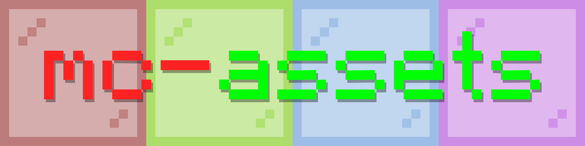

# MC Assets



```bash
npm i mc-assets
```

**NEXT-GEN Minecraft Assets Library**

## Features

- **NEW ITEMS FORMAT SUPPORT!!!** - Get different item models based on conditions (using item, display context, etc)
- **Automatic Updates** - This library is automatically updated and published to npm.
- **Fully Typed** - Today is nothing can be done without TypeScript. We ship best type definitions possible.
- **Early Access** - It always includes the latest pre and rc (release candidate) version.
- **Version Accurate** - Includes all released versions starting from 1.7.10.
- **Memory Efficient** - Small installation size, for the fastest download & loading time.
- **Simple & Complete API** - Works in browsers out of the box and provides parsers for all the data this library provides.
- **Easy to Use Items Textures** - Includes hand-crafted isometric textures for some blocks.
- **Block Entities Models** - Includes community-crafted models for block entities.

This module was originally designed as standalone package for [https://mcraft.fun](mcraft.fun) (repo) project so it is easier to maintain, but now it became a library that I think can cover any use case where you need to work with minecraft assets. This library means block states, models data and texture contents, it doesn't cover minecraft-data use cases. With the best block model parser you can build your own renderers, editors, etc.

For contributing & building instructions see [building](#building) section.

> Bundled modules & block states are version-accurate starting from 1.13.0 (post-flattening) version.
> Tested on Node.js 18 and above.

<!-- GENERATED -->

[Atlas explorer (web demo)](https://zardoy.github.io/mc-assets/).

[External Models Playground](https://mcraft.fun/playground.html)

## Usage

Following atlases are generated:

- Items
- Blocks (block entities included)
- Particles

```ts
import { AssetsParser, getLoadedModelsStore, getLoadedBlockstatesStore } from 'mc-assets'
import blockstatesModels from 'mc-assets/dist/blockStatesModels.json'

const blockstatesStore = getLoadedBlockstatesStore(blockstatesModels)
const modelsStore = getLoadedModelsStore(blockstatesModels)
// get block states for specific block
const stoneModels = blockstatesStore.get('latest', 'stone').variants['']
// [
//   { model: 'block/stone' },
//   { model: 'block/stone_mirrored' },
//   { model: 'block/stone', y: 180 },
//   { model: 'block/stone_mirrored', y: 180 }
// ]
const model = modelsStore.get('latest', 'block/stone_mirrored')
// { parent: 'block/cube_mirrored_all', textures: { all: 'block/stone' } }

// note: you can always specify a specific version instead of 'latest'
const assetsParser = new AssetsParser('latest', blockstatesStore, modelsStore)

const resolvedModel = assetsParser.getAllResolvedModels({
    name: 'stone', // block name not model name
    properties: {},
}, false) // false (default) means return empty if variant matching properties is not found
// [
//   [
//     {
//       x: undefined,
//       y: undefined,
//       z: undefined,
//       uvlock: undefined,
//       weight: undefined,
//       textures: {
//         all: 'block/stone',
//         particle: 'block/stone',
//         down: 'block/stone',
//         up: 'block/stone',
//         north: 'block/stone',
//         east: 'block/stone',
//         south: 'block/stone',
//         west: 'block/stone'
//       },
//       elements: [
//         {
//           from: [ 0, 0, 0 ],
//           to: [ 16, 16, 16 ],
//           faces: {
//             down: { texture: 'block/stone', cullface: 'down' },
//             up: { texture: 'block/stone', cullface: 'up' },
//             north: { texture: 'block/stone', cullface: 'north' },
//             south: { texture: 'block/stone', cullface: 'south' },
//             west: { texture: 'block/stone', cullface: 'west' },
//             east: { texture: 'block/stone', cullface: 'east' }
//           }
//         }
//       ]
//     }
//   ],
//   [ ... ] // second variant and so on
// ]
```

`getAllResolvedModels` returns an array of arrays, where first depth level is model parts, second depth level is variants (for example Minecraft chooses them randomly). You can use `getResolvedModelFirst` to get first variant only. Or `getResolvedModelRandom` to get a random variant.

### Rendering Atlas Textures

```ts
import { AssetsParser, AtlasParser } from 'mc-assets'
import blocksAtlases from 'mc-assets/dist/blocksAtlases.json'
import blocksAtlasLatest from 'mc-assets/dist/blocksAtlasLatest.png'
import blocksAtlasLegacy from 'mc-assets/dist/blocksAtlasLegacy.png'

const atlasParser = new AtlasParser(blocksAtlases, blocksAtlasLatest, blocksAtlasLegacy) // blocksAtlasLegacy is optional

const diamondOreTexture = atlasParser.getTextureInfo('diamond_ore', '1.13') // get old diamond ore texture
const img = await diamondOreTexture.getLoadedImage()

const canvas = document.createElement('canvas')
const sourceWidthSize = img.width * diamondOreTexture.su // 16
const sourceHeightSize = img.width * diamondOreTexture.sv // 16
canvas.width = 128
canvas.height = 128
document.body.appendChild(canvas)

const ctx = canvas.getContext('2d')!
ctx.imageSmoothingEnabled = false

ctx.drawImage(img, diamondOreTexture.u * img.width, diamondOreTexture.v * img.height, sourceWidthSize, sourceHeightSize, 0, 0, canvas.width, canvas.height)


// create new custom texture atlas (e.g. resource pack overrides)
const { atlas, canvas, newAtlasParser } = await atlasParser.makeNewAtlas('1.13') // with second argument (callback) you can override textures, with third use different tile size (use it if you have high-res textures)
const image = canvas.toDataURL() // get image data url if you need it
const diamondOreTexture = newAtlasParser.getTextureInfo('diamond_ore') // get old diamond ore texture (essentially the same as above)
```

### Getting Other Textures

Textures without atlases are stored in `dist/other-textures` folder. You can use them like this:

```ts
import unmute_button from 'mc-assets/dist/other-textures/latest/gui/sprites/social_interactions/unmute_button.png'
import unmute_button_highlighted from 'mc-assets/dist/other-textures/latest/gui/sprites/social_interactions/unmute_button_highlighted.png'

const Button = styled.button`
    background-image: url(${unmute_button});
    background-size: cover;
    background-position: center;
    background-repeat: no-repeat;
    border: none;
    outline: none;
    cursor: pointer;
    width: 32px;
    height: 32px;
`

const ButtonHighlighted = styled(Button)`
    background-image: url(${unmute_button_highlighted});
`
```

Please, don't use json / image files directly as their format is not stable and can change in the future, use the parsers instead.

### Item Definitions

The library provides a powerful system to handle dynamic item models that change based on various conditions:

```ts
import { getLoadedItemDefinitionsStore } from 'mc-assets'
import { getItemDefinition } from 'mc-assets/dist/itemsDefinitions'
import itemDefinitions from 'mc-assets/dist/itemDefinitions.json'

const store = getLoadedItemDefinitionsStore(itemDefinitions)
// we have zod schema as well as typescript types for item definitions

// Example 1: Bow animation when pulling
const bowModel = getItemDefinition(store, {
    version: 'latest',
    name: 'bow',
    properties: { // full autocomplete of supported properties
        'minecraft:using_item': true,
        'minecraft:use_duration': 20 // Time in ticks, affects pull-back animation
    }
})
// Returns: { model: 'minecraft:item/bow_pulling_2' } for full pull-back

// Example 2: Bundle with items in inventory
const bundleModel = getItemDefinition(store, {
    version: 'latest',
    name: 'brown_bundle',
    properties: {
        'minecraft:display_context': 'gui',
        'minecraft:bundle/has_selected_item': true
    }
})
// Returns composite model showing bundle with items when in inventory

// Example 3: Clock showing time in different dimensions
const clockModel = getItemDefinition(store, {
    version: 'latest',
    name: 'clock',
    properties: {
        'minecraft:time': 0.5,
        'minecraft:context_dimension': 'minecraft:overworld'
    }
})
// Returns appropriate clock face model based on time

// Example 4: Compass pointing to targets
const compassModel = getItemDefinition(store, {
    version: 'latest',
    name: 'compass',
    properties: {
        'minecraft:compass': 16,
        'minecraft:context_dimension': 'minecraft:overworld',
        'minecraft:has_component': false // true for lodestone compass
    }
})
// Returns compass model pointing in the right direction

// Example 5: Armor with trims
const armorModel = getItemDefinition(store, {
    version: 'latest',
    name: 'chainmail_boots',
    properties: {
        'minecraft:trim_material': 'minecraft:diamond'
    }
})
// Returns: { model: 'minecraft:item/chainmail_boots_diamond_trim' }
```

The item definition system supports various property types:
- `minecraft:using_item`: Boolean for items being actively used
- `minecraft:use_duration`: Number of ticks an item has been used
- `minecraft:display_context`: Where the item is being displayed ('gui', 'ground', 'fixed', etc.)
- `minecraft:time`: Time value for clock animations
- `minecraft:context_dimension`: Current dimension affecting item behavior
- `minecraft:compass`: Direction value for compass
- `minecraft:has_component`: Special properties like lodestone tracking
- `minecraft:trim_material`: Material used for armor trims
- `minecraft:bundle/has_selected_item`: Bundle content state
- And more...

Each model can include:
- Base model path
- Tint information
- Special rendering instructions
- Watch properties for dynamic updates

Handy method `getItemDefinitionModelResolved` is provided which includes the resolved texture information:

```ts
import { ItemsRenderer } from 'mc-assets'

const renderer = new ItemsRenderer(/* ... */)
const resolvedModel = getItemDefinitionModelResolved(store, {
    version: 'latest',
    name: 'bow',
    properties: { /* ... */ }
}, renderer)
// Returns texture info ready to render
```

## Building

```bash
pnpm i
# recommended but not required (will speed up build by fetching cache from gh-pages branch)
pnpm use-cached-datapaths
pnpm build
```

Then if you only changing block entities, you can run `pnpm regen-blockentities` to regenerate block entities.
If you only change consumer code you can run `pnpm watch-dist` to watch for changes and rebuild.

To use in `minecraft-web-client` or your own project just run `pnpm link mc-assets` once or use `file:../mc-assets` in your `package.json` file if you are using other package manager.
