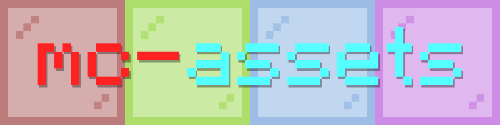

# MC Assets



```bash
npm i mc-assets
```

**NEXT-GEN Minecraft Assets Library**

## Features

- **Automatic Updates** - This library is automatically updated and published to npm.
- **Fully Typed** - Today is nothing can be done without TypeScript. We ship best type definitions possible.
- **Early Access** - It always includes the latest pre and rc (release candidate) version.
- **Version Accurate** - Includes all released versions starting from 1.7.10.
- **Memory Efficient** - Small installation size, for the fastest download & loading time.
- **Simple & Complete API** - Works in browsers out of the box and provides parsers for all the data this library provides.

This module was originally designed as standalone package for [https://mcraft.fun](mcraft.fun) (repo) project so it is easier to maintain, but now it became a library that I think can cover any use case where you need to work with minecraft assets. Minecraft assets means block states, models info and texture contents, it doesn't cover minecraft data use cases.

> Bundled modules & block states are version-accurate starting from 1.13.0 (post-flattening) version.
> Tested on Node.js 18 and above.

## Usage

```ts
import { AssetsParser, getLoadedModelsStore, getLoadedBlockstatesStore } from 'mc-assets'
import blockstatesModels from 'mc-assets/dist/blockStatesModels.json'

const modelsStore = getLoadedModelsStore(blockstatesModels)
const blockstatesStore = getLoadedBlockstatesStore(blockstatesModels)
const assetsParser = new AssetsParser('latest', blockstatesStore, modelsStore)
```
